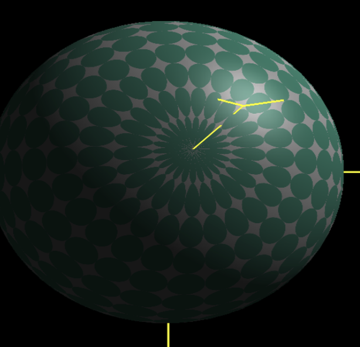

# CS 457 Project #1 - Step- and Blended-edged Elliptical Dots

**Author**: Colin Cheng  

## 🧠 Project Description

This project implements a GLSL-based 3D rendering of a sphere covered with **elliptical dots**, showcasing both **step-edged** and **blended-edged** patterns. Users can dynamically manipulate the ellipse parameters and observe the immediate effects on the pattern distribution and edge sharpness.

### ✨ Visual Features

- **Hard-edged elliptical dots**: Clear boundary ellipses using direct color cutoff.
- **Smooth-edged elliptical dots**: Gradual transition at edges using `smoothstep()`.
- **Per-fragment lighting**: Incorporates ambient, diffuse, and specular components for realism.
- **Real-time control**: Users can adjust:
  - `uAd` – Ellipse horizontal stretch (keys: `a`, `A`)
  - `uBd` – Ellipse vertical stretch (keys: `b`, `B`)
  - `uTol` – Tolerance for blending the ellipse edges (keys: `t`, `T`)

## 🎮 Controls

| Key | Action |
|-----|--------|
| A   | Increase `uAd` (horizontal stretch) |
| a   | Decrease `uAd` |
| B   | Increase `uBd` (vertical stretch) |
| b   | Decrease `uBd` |
| T   | Increase `uTol` (blending tolerance) |
| t   | Decrease `uTol` |

## 🔧 Technical Highlights

- **Shader Programming**:
  - **Vertex Shader**: Calculates per-vertex lighting and interpolates data for the fragment shader.
  - **Fragment Shader**: Renders the elliptical dot pattern with lighting and edge blending.
- **Pattern Control**:
  - Uses mathematical ellipse equations to define dot regions.
  - `smoothstep()` is used to create smooth transitions for soft edges.
- **Dynamic Uniforms**:
  - Parameters are adjustable in real-time through keyboard input.

## 📷 Screenshots

_Demonstrating the effects of `uAd`, `uBd`, and `uTol` on the elliptical pattern._

### 1. Step-edged Elliptical Dots

### 2. Blended-edged Elliptical Dots

### 3. Horizontal and Vertical Stretch Variation

### 4. Lighting with Dots Applied

## 📁 Files

- `pattern.frag`
- `pattern.vert`
- `main.cpp` or any associated rendering logic
- Makefile / build script (if applicable)

## 📚 Acknowledgments

- Shader structure and lighting model are based on course-provided material from CS 457 (Spring 2025).
- Inspired by parametric control and procedural pattern generation in GLSL.

