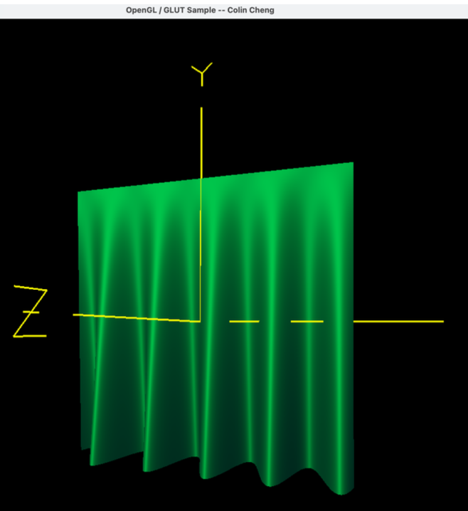
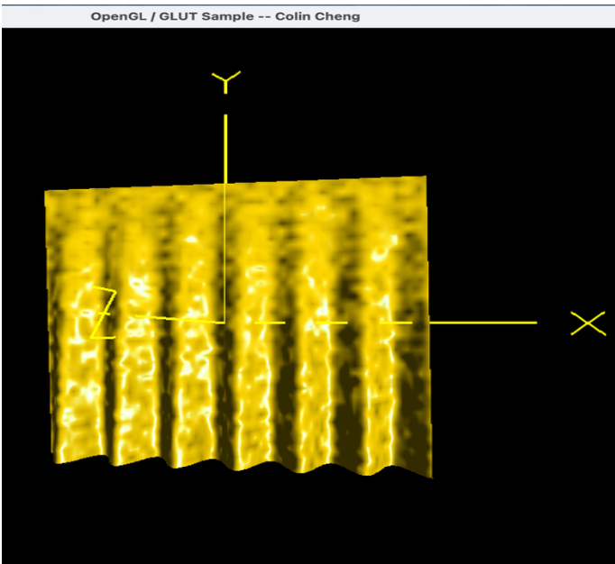

# Project 3A & 3B – Displacement & Bump Mapping with Lighting

This two-part project showcases realistic rendering techniques using **displacement mapping**, **bump mapping**, and **per-fragment lighting** in GLSL. The subject is a 3D curtain model whose surface is dynamically transformed using mathematical wave functions and enhanced through lighting and surface detail perturbations.

---

## 🌊 Project 3A – Displacement Mapping & Lighting

This phase introduced **displacement mapping** to simulate curtain pleats using a sine wave. The surface starts flat and deforms more as it moves downward. The lighting reflects this displaced geometry to highlight contour and depth.

### Key Features:
- **Displacement via sine wave**: Applied in the vertex shader to push vertices in the z-direction.
- **Recalculated normals**: Using tangent vectors and cross products for accurate lighting.
- **Lighting model**: Ambient, diffuse, and specular effects per fragment.
- **Dynamic controls**:
  - `M/m`: Increase/decrease amplitude of the sine wave.
  - `E/e`: Increase/decrease period.

---

## 🪡 Project 3B – Displacement, Bump Mapping & Lighting

Building on 3A, this phase integrates **bump mapping** to enhance surface texture by perturbing normals without changing geometry. The result is a more tactile, detailed curtain.

### Additions in 3B:
- **Bump Mapping**: Uses a noise texture to perturb normals in the fragment shader.
- **Enhanced realism**: Combines displacement (geometry-level) and bump (normal-level) detail.
- **More uniform controls**:
  - `K/k`: Adjust bump mapping amplitude (`uNoiseAmp`)
  - `L/l`: Adjust bump mapping frequency (`uNoiseFreq`)

### Shader Details:
- **Vertex Shader**: Handles displacement and normal recalculation.
- **Fragment Shader**: Applies lighting and bump mapping with noise texture.

---

## 🔧 Uniforms Summary

| Key | Effect |
|-----|--------|
| `M/m` | Increase/decrease sine amplitude (displacement) |
| `E/e` | Increase/decrease sine period (displacement) |
| `K/k` | Increase/decrease bump mapping amplitude |
| `L/l` | Increase/decrease bump mapping frequency |

---

## 📸 Visual Examples

Add screenshots here once stored in your repo:

