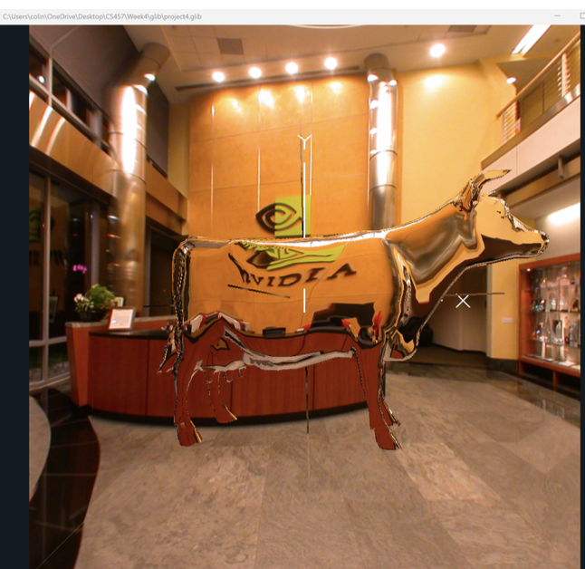

# Project 4 – Cube Mapping: Reflective and Refractive Surfaces

This project showcases cube mapping techniques for rendering realistic **reflection** and **refraction** effects on 3D surfaces. A cow model (`cow.obj`) is rendered within a scene using cube-mapped environmental textures, with both surface types dynamically blended and noise-enhanced for realism.

---

## ✨ Project Features

- **Reflective and Refractive Rendering**:
  - Implemented using GLSL shaders and NVIDIA cube map textures.
  - Refraction and reflection are blended based on the `uMix` parameter.
  - Refraction responds to `uEta` (index of refraction) ranging from 1.2 to 2.0.

- **Perturbed Normals with 3D Noise**:
  - Noise amplitude (`uNoiseAmp`) and frequency (`uNoiseFreq`) control how normals are distorted to simulate bumpy or uneven surfaces.

- **Realistic Material Effects**:
  - Cube maps are sampled for both reflection and refraction.
  - A custom blending shader (fragment and vertex) combines lighting effects with noise-based surface variation.

---

## 🔧 Shaders & GLIB Setup

- **GLIB File**:
  - Adapted from course sample to place `cow.obj` in a cube-mapped environment.
  - Applies textures for both cube map reflections and contextual walls.

- **Shaders**:
  - `cube.vert`: Transforms vertex data, computes eye and normal vectors.
  - `cube.frag`: Blends cube-mapped reflection and refraction; perturbs normals using a 3D noise texture.
  - `texture.vert` and `texture.frag`: Used for rendering the wall textures.

---

## 🎛️ Interactive Parameters (Uniforms)

| Uniform      | Description                                        |
|--------------|----------------------------------------------------|
| `uMix`       | Controls blend between reflection and refraction   |
| `uEta`       | Index of refraction (1.2 to 2.0)                   |
| `uNoiseAmp`  | Amplitude of normal perturbation                   |
| `uNoiseFreq` | Frequency of normal perturbation                   |
| `uWhiteMix`  | Additional blending factor for final color output  |

---

## 📸 Visual Output

The rendered results demonstrate:
- Pure refraction
- Refraction with noise
- Pure reflection
- Reflection with noise

Add screenshots in your repository like this:

