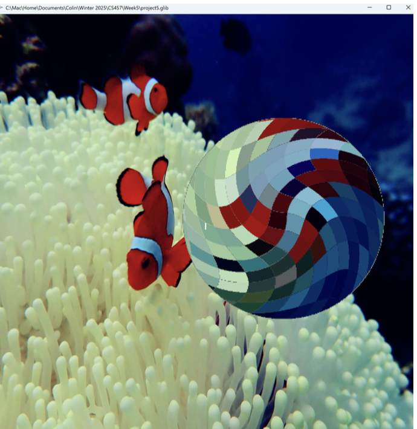
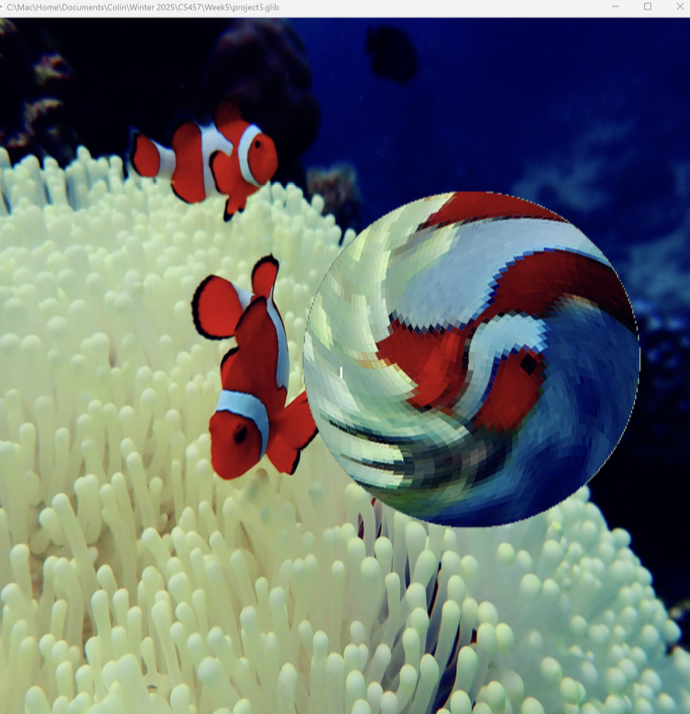
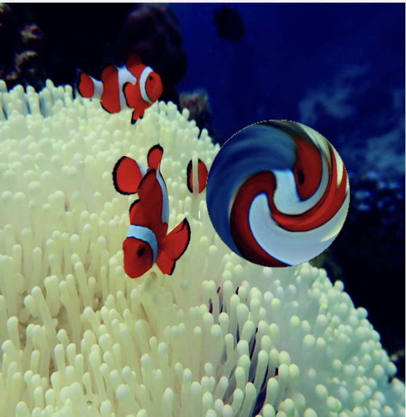
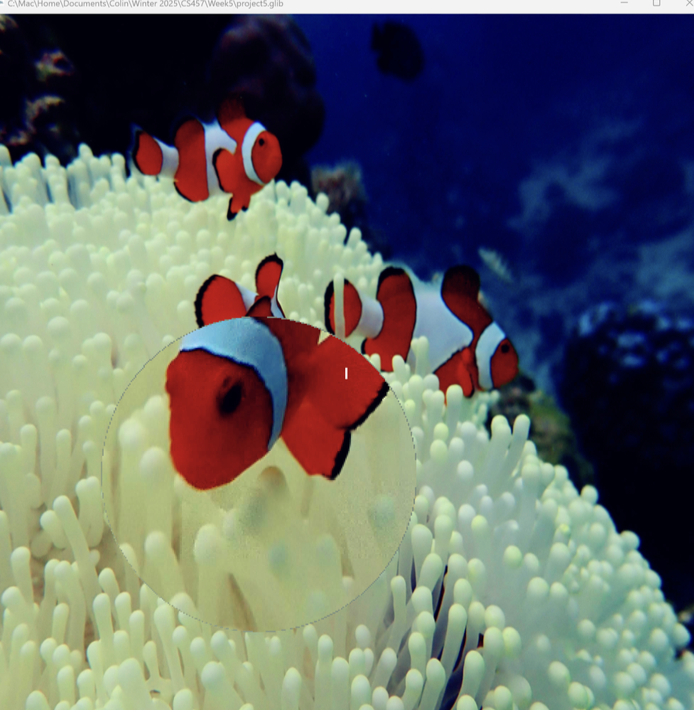

# Project 5 – Image Manipulation in a "Magic Lens"

This project implements a dynamic **Magic Lens** visualization tool that applies localized image effects—magnification, whirling, and mosaic—within a circular lens overlay. The lens interacts with user-controlled parameters and affects only the selected region of a 2D textured image.

---

## 🔍 Overview

The project uses a custom image (scuba diving photo) mapped onto a quad and displayed using OpenGL. The lens is implemented entirely in the **fragment shader**, with conditional logic determining whether a pixel lies inside or outside the lens boundary.

Inside the lens, one or more transformations can be applied:
- **Magnification**
- **Whirling (radial rotation)**
- **Mosaic (pixelation)**

Outside the lens, the original image remains unaffected, creating a striking contrast.

---

## 🧠 Key Features

- **Magnification**:
  - Zooms into the area under the lens.
  - Controlled by `uMag`.

- **Whirl Effect**:
  - Rotational distortion around the center of the lens.
  - Controlled by `uWhirl`.

- **Mosaic Effect**:
  - Divides the lens into pixel blocks; each block samples from its center.
  - Controlled by `uMosaic`.

- **Lens Movement and Scaling**:
  - `uSc` / `uTc`: Control the lens center (horizontal/vertical).
  - `uRad`: Controls the lens radius.

---

## 🎮 Interactive Parameters

| Uniform    | Description                              |
|------------|------------------------------------------|
| `uSc`      | Horizontal center of the lens            |
| `uTc`      | Vertical center of the lens              |
| `uRad`     | Radius of the lens                       |
| `uMag`     | Magnification factor                     |
| `uWhirl`   | Strength of whirl (angular distortion)   |
| `uMosaic`  | Mosaic resolution (grid size)            |

---

## 🧪 Shader Logic Summary

- **Outside the lens**:
  - Pixels are rendered normally using default texture coordinates.
  
- **Inside the lens**:
  - Shader checks the pixel’s radial distance `r` from the center.
  - Applies the selected effects (magnify, whirl, mosaic) based on uniform values.
  - Blends effects seamlessly at the lens edge.

---

## 📸 Example Results

Include screenshots using:

```markdown



