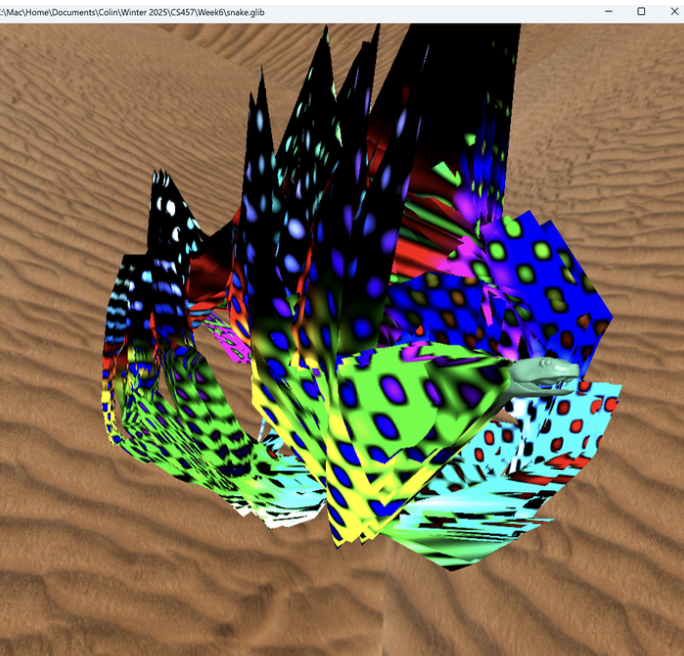
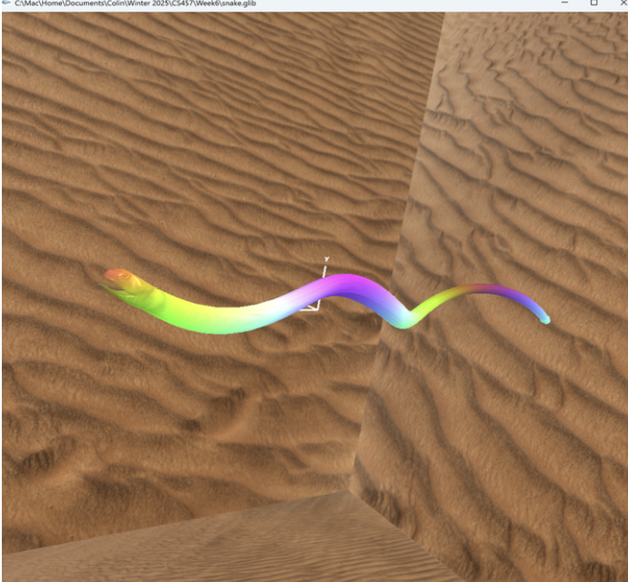
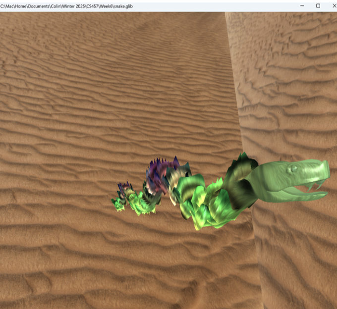
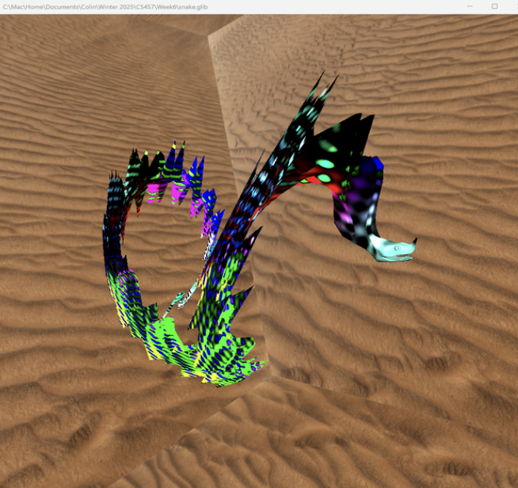
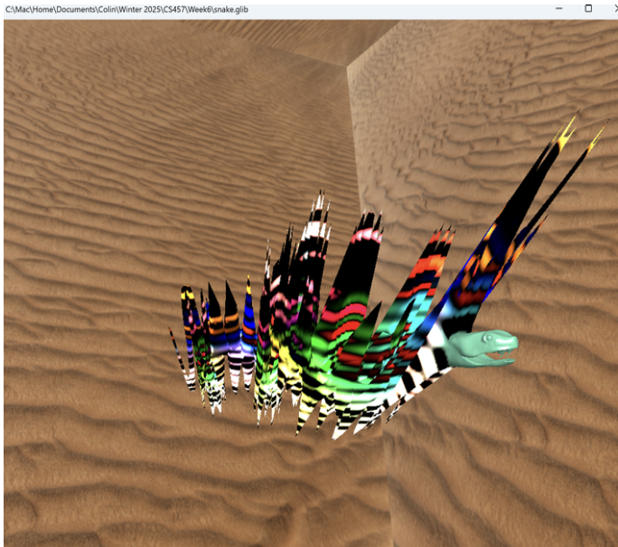
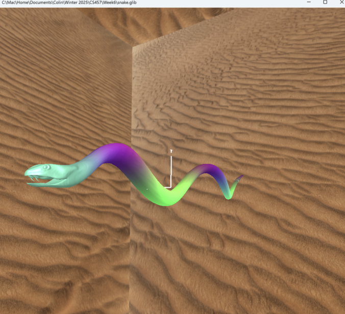

# Project 6 – The Snake Menagerie

This project presents a procedurally animated and textured **snake model** that combines multiple sine wave displacements, noise perturbations, and smooth transitions to achieve an organic, lifelike motion. The result is a textured, rippling snake that moves naturally and transitions smoothly near the head region.

---

## 🐍 Overview

The snake’s body movement is driven by a **composite sine wave** displacement:
- A base sine wave controls the primary wavy motion.
- A second sine wave with a different frequency overlays a ripple effect.
- Noise is added using a combination of `sin(uNoiseFreq * x) * sin(uNoiseFreq * y)` to simulate irregular, organic motion.

To prevent harsh transitions, especially near the head:
- A **`smoothstep` function** gradually fades out the wave motion as it approaches the head.
- This replaces the original hard cutoff method, creating smoother, more natural animation.

---

## 🧠 Key Features

- **Dual sine-wave displacement**:
  - Simulates realistic snake motion.
  - Second frequency adds complexity and ripple.

- **Noise-based displacement**:
  - Introduces randomness to the motion for more organic movement.

- **Smooth transition at the head**:
  - Controlled using `smoothstep` and `HeadRadius` for soft blending.

- **Adjustable head radius**:
  - `HeadRadius` parameter fine-tunes where motion fades, allowing dynamic configuration.

- **Textured shading**:
  - Blends procedural colors with texture maps for a richer surface appearance.
  - Lighting effects are preserved even as bump mapping tapers off near the head.

---

## 🎮 Interactive Parameters

| Parameter     | Description                                      |
|---------------|--------------------------------------------------|
| `uNoiseFreq`  | Controls the frequency of the noise-based ripple |
| `HeadRadius`  | Controls where the motion begins to fade         |

All parameters are configurable in the `.glib` file.

---

## 📸 Screenshots

Add screenshots using:

