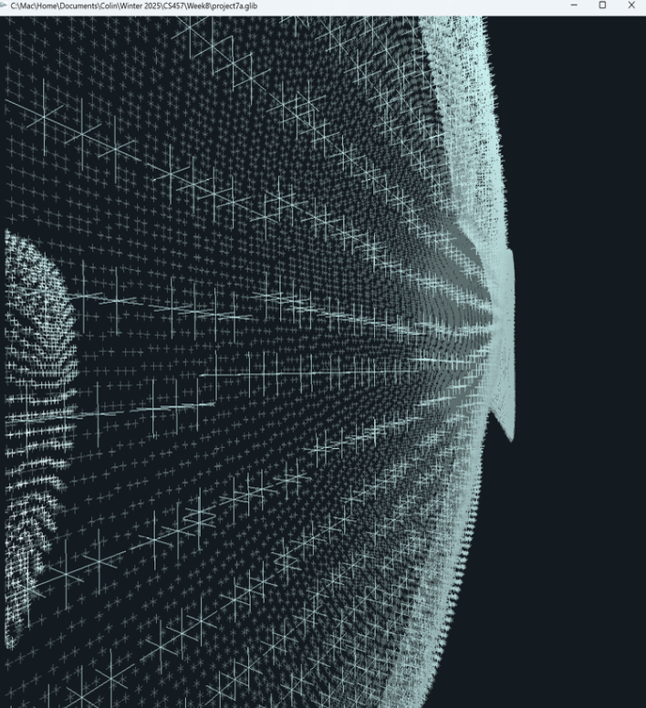
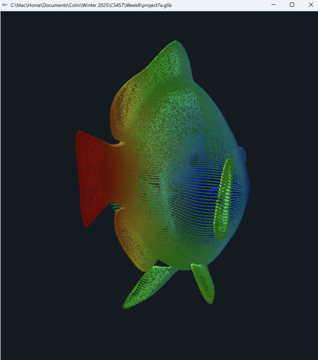
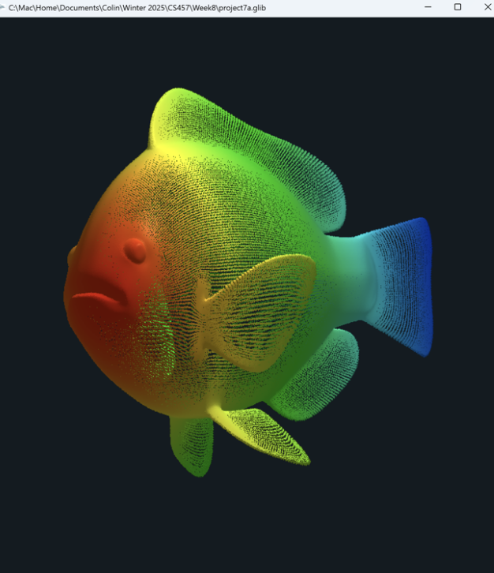

# Project 7A – Geometry Shaders: 3D Cross Reconstruction

This project explores the power of **geometry shaders** by transforming a triangle-based 3D model into a visually unique collection of 3D crosses ("plus signs"). Each triangle of the input model is subdivided, and small crosses are generated at each subdivided vertex. The result is a stylized mesh-like structure with tunable parameters and chroma depth coloring.

---

## 🔧 Project Highlights

- **Input Model**: A triangle-based OBJ model (e.g., fish.obj).
- **Output**: 3D cross mesh rendered from triangle subdivision points.

### 🔁 Core Functionality

- **Triangle Subdivision**:
  - Each triangle is subdivided into smaller triangles based on `uLevel`.
  - At every vertex of the subdivided triangles, a 3D cross is generated.

- **Cross Generation**:
  - Each cross is composed of three orthogonal line segments.
  - Controlled by `uSize` to adjust the cross length.

- **Quantization**:
  - Vertex positions are snapped to discrete values using `uQuantize`.
  - Higher quantization levels create a stepped, grid-like aesthetic.

- **Per-Fragment Lighting**:
  - Uses ambient, diffuse, and specular lighting components.
  - Helps distinguish individual crosses with shading.

- **ChromaDepth (Extra Credit)**:
  - Enabled via `uUseChromaDepth`.
  - Colors vary based on depth (Z-value in eye space): red (near) to blue (far).
  - Controlled with `uRedDepth` and `uBlueDepth`.

---

## 🎮 Parameter Controls

| Uniform         | Description                                          |
|------------------|------------------------------------------------------|
| `uLevel`         | Subdivision level per triangle                       |
| `uQuantize`      | Controls vertex snapping resolution                  |
| `uSize`          | Length of each cross's arms                          |
| `uKa`, `uKd`, `uKs` | Ambient, diffuse, specular reflection constants |
| `uShininess`     | Specular highlight sharpness                         |
| `uUseChromaDepth`| Toggle ChromaDepth coloring (boolean)               |
| `uRedDepth`      | Depth at which color appears red                    |
| `uBlueDepth`     | Depth at which color appears blue                   |

---

## 🧪 Shader Implementation

- **Vertex Shader**: Passes data to geometry shader.
- **Geometry Shader**:
  - Subdivides triangles.
  - Emits line segments for each 3D cross at subdivision points.
- **Fragment Shader**:
  - Applies lighting (Phong-style).
  - Optionally applies chromadepth coloring based on view depth.

---

## 📸 Screenshots

Demonstrating front, back, top, and side views with varying `uLevel`, `uQuantize`, and `uSize`.

